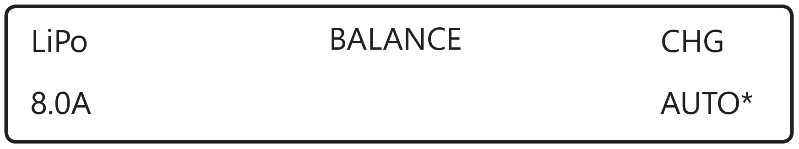
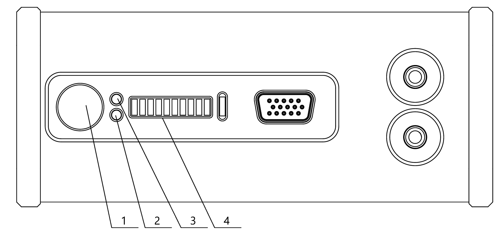

Зарядная станция и АКБ
=========================

.. csv-table:: **Характеристики АКБ**
   
   "Количество рабочих циклов (заряд-разряд)", "не менее 50"
   "Верхний предел заряда", "42 В"
   "Номинальное напряжение", "37 В"
   "Нижний предел разряда", "33 В"
   "Ток разряда", "<64 А"
   "Количество ячеек", "4"
   "Емкость", "16 000 мА·ч"
   "Срок службы", "1 год"

Техника безопасности
----------------------

**АКБ**

* Не допускать разгерметизации и деформации элементов АКБ (не ронять, не прокалывать).
* Не допускать нагрева АКБ свыше 60 градусов.
* Не допускать перезаряда АКБ (свыше 42В).
* Не допускать разряда АКБ ниже 30В.
* Не хранить в разряженном состоянии, при длительном хранении АКБ (месяц и более) необходимо перевести АКБ в режим «storage» (хранение).
* Не заряжать токами, превышающими нагрузочную способность (не более 100% от емкости, для продления срока службы рекомендуется заряжать 50% током от емкости). Превышение допустимого тока заряда приведет к нагреву АКБ свыше 60 градусов.
* Несоблюдение выше перечисленных указаний может привести к возгоранию или к полному выходу из строя АКБ.

**Зарядная станция**

* Перед подключением АКБ к зарядному устройству необходимо предварительно включить зарядное устройство.
* Перед каждым использованием необходимо производить осмотр кабелей и разъемов на предмет повреждений.
* Запрещается эксплуатировать зарядное устройство под прямыми солнечными лучами.
* Запрещается эксплуатировать зарядное устройство без присмотра.

С завода комплекс поставляется с настроенным зарядным устройством. Если настройки сбились - следуйте инструкции, чтобы их восстановить.

Предварительные настройки зарядного устройства
----------------------------------------------------

Чтобы войти в меню настроек, необходимо:

* на экране **PROGRAM SELECT** (основной экран) многократно нажать кнопку **Batt type/Stop**, пока на дисплее не появится раздел **Settings**;

* подтвердить выбор нажатием кнопки **Start/Enter**.

* навигация по меню настроек осуществляется при помощи кнопок **Dec/Inc**

В меню **Settings** необходимо установить следующие настройки:

* снять ограничение времени заряда. Для этого необходимо при помощи кнопок **Dec/Inc** выбрать параметр **Safety timer**:

   Задание параметра Safety timer

При нажатии кнопки **Start/Enter** станет активна функция изменения **ON/OFF**, кнопкой **Dec/Inc** выберите положение **OFF**, затем нажмите **Start/Enter** пока на экране не перестанут мигать настройки.

* снять ограничение емкости заряжаемой АКБ. Для этого необходимо при помощи кнопок **Dec/Inc** параметр **Capacity cut-off**. 

   Задание параметра Capacity cut-off

При нажатии кнопки **Start/Enter** станет активна функция изменения **ON/OFF**, кнопкой **Dec/Inc** выберите положение **OFF**, затем нажмите **Start/Enter** пока на экране не перестанут мигать настройки.

Для выхода из раздела **Settings** нажмите кнопку **Batt type/Stop**.

* На экране **PROGRAM SELECT** (основной экран) при помощи **Dec/Inc** выберите пункт **Lithium battery** и подтвердите нажатием кнопки **Start/Enter**, затем выберите следующие настройки:

   Настройки

Параметр **AUTO** в автоматическом режиме определяет количество ячеек (S) в аккумуляторе. Остальные значения в меню настроек менять не рекомендуется.

Зарядка может производиться либо от сети, либо от автомобильной АКБ.

Порядок подключения АКБ к зарядному устройству
-----------------------------------------------------

* Подключите балансировочный разъем.
* Подключите положительную клемму (красный провод).
* Подключите отрицательную клемму (черный провод).

.. Attention:: При зарядке от автомобильной АКБ, убедитесь, что двигатель автомобиля запущен, иначе автомобильная АКБ полностью разрядится в процессе зарядки.

Плата индикации АКБ
------------------------

   индикаторы и разъемы на корпусе АКБ

Нажмите на кнопку (1), чтобы просмотреть статус АКБ. После нажатия светодиодная полоса (4) отобразит уровень заряда зелеными делениями, затем красными делениями - внутреннюю температуру (см. таблицу). 
* Зеленый цвет светодиода (2) означает отображение напряжения АКБ (разряженный АКБ – светодиодная полоса (4) полностью выключена, полный заряд – вся полоса горит красным).
* Красный цвет светодиода (2) означает отображение температуры внутри АКБ.

.. csv-table:: **Индикация температуры АКБ**
   :header: "Количество светодиодов", "Режим свечения", "Температура, С"
   

   "I", "мигает", "< 5"
   "II", "мигает", "5-10"
   "III", "мигает", "10-15"
   "IIII", "горит", "15-20"
   "IIIII", "горит", "20-25"
   "IIIIII", "горит", "25-30"
   "IIIIIII", "мигает", "30-35"
   "IIIIIIII", "мигает", "35-40"
   "IIIIIIIII", "мигает", "40-45"
   "IIIIIIIIII", "мигает", ">=45"

Светодиод выключен и деления светодиодной полосы гаснут справа налево – отображение отсчета до завершения режима индикации, при котором можно перейти в режим поддержания температуры (для АКБ модификации «Арктика») и за которое необходимо вставить АКБ в БВС для обмена информацией с бортовой электроникой.

После этого светодиодная полоса загорится желтым цветом, и деления начнут гаснуть одно за другим. Пока не погасло последнее деление, вы можете перевести батарею в режим поддержания температуры (модификация "Арктика"), или подключить АКБ к БВС для обмена информацией с бортовой электроникой.

.. Attention:: 
 Внимание! Не подсоединяйте внешний источник питания к АКБ при активированном режиме индикации.

.. csv-table:: **Ключевые значения заряда АКБ**
   :header: "Тип АКБ", "Заряжен", "Половина заряда", "Заряд близок к нулю", "Разряжен", "Потеря питания, выход АКБ из строя"

   "10S 16Ач", "42,0 В", "37,0 В", "35,0 В", "33,0 В", ">25,0 В"

Скорость разряда АКБ напрямую зависит от уровня тяги двигателей. БВС регулирует уровень тяги исходя из погодных условий и траектории маршрута. Так, при построении полигона, желательно делать его прямоугольным с минимальным количеством разворотов и максимально длинными “галсами”. Следуя данным рекомендациям, можно увеличить эффективность полетов.

.. Attention:: При снижении уровня заряда до 35 В, АКБ начнет разряжаться быстрее.

Правила эксплуатации литий-полимерного (LiPo) АКБ
------------------------------------------------------

Во избежание аварийных ситуаций, связанных с нештатной работой АКБ, необходимо соблюдать ряд правил:

* Если полеты проходят при температуре воздуха ниже 0 °C, перед полетом необходимо хранить АКБ в теплом месте и не допускать его охлаждения. Следует помнить, что на холоде литий-полимерные АКБ могут терять до 30% своей емкости, данное обстоятельство необходимо учитывать при построении полетного задания;

* Если полеты проходят при температуре воздуха свыше 25 °C, перед полетом необходимо хранить АКБ в прохладном, защищенном от попадания прямых солнечных лучей месте. После полета нельзя сразу заряжать АКБ, необходимо дать ей остыть. Заряжать также необходимо в прохладном месте, защищенном от попадания прямых солнечных лучей. 

Хранение и разряд
--------------------------------------------

**Хранение**

Режим хранения необходим, если предполагается не использование АКБ более 14 дней.

Для перевода АКБ в режим хранения, необходимо сменить режим **BALANCE CHG** на режим **STORAGE**, проверив правильность количества ячеек на экране (10 Cells) и запустить его длинным нажатием кнопки **Start/Enter**.

Хранить в сухом прохладном месте, исключающем воздействие прямых солнечных лучей, при температуре от 5 до 25 °С и относительной влажности не более 80%, без конденсации. 

Оптимальная температура — от 5 до 10 °С. 

Оптимальный уровень напряжения АКБ при помещении батареи на хранение: 38,5 В. 

Срок хранения - 1 год.

**Разряд**

Для разряда АКБ необходимо выбрать режим **DCHG**, проверив правильность количества ячеек на экране (10S). Задать ток разряда 16 A (дальше З/У будет регулировать ток разряда исходя из своих возможностей) и запустить его длинным нажатием кнопки **Start/Enter**.

Возможные неисправности и их устранение
-------------------------------------------

Если после нажатия кнопки (1) на панели АКБ крайний правый светодиод на полосе загорится красным, это сигнализирует о появлении ошибки в системе. Светодиоды №№ 1 и 2 слева отображают код неисправности.

* Горит светодиод 1 - ошибка внутренней связи. Повторите попытку через несколько секунд. Если проблема возникает часто, обратитесь к производителю.
* Горит светодиод 2 - низкое напряжение на ячейке. Если после заряда АКБ ошибка не исчезает, обратитесь к производителю.
* Одновременно горят светодиоды 1 и 2 - низкое напряжение внешнего источника. Замените внешний источник на исправный. Если АКБ подключена к автомобильному аккумулятору, запустите двигатель.

Утилизация АКБ
-----------------

.. attention:: Не выбрасывайте LiPo батареи в контейнеры для бытового мусора. 
 Неправильная утилизация отработавших источников питания может представлять опасность для окружающей среды.
 Утилизируйте LiPo батареи в соответствии с местным законодательством, сдавая их в ближайшие пункты переработки.

