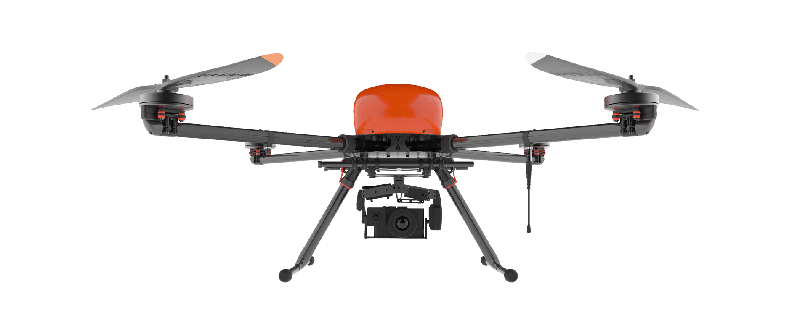
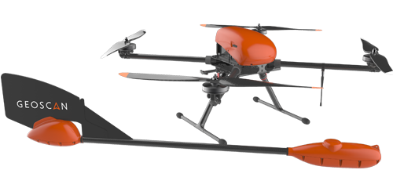
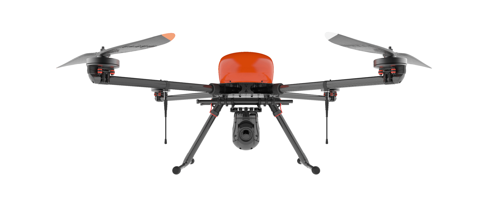
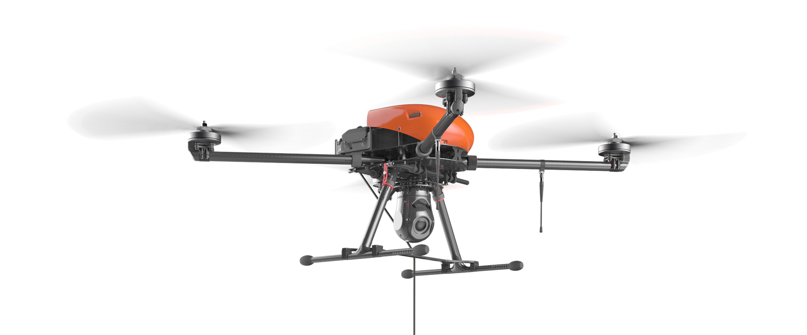

Общие сведения
==================

Геоскан 401 – аэрофотосъемочный комплекс с вертикальным взлетом и посадкой.

Комплектация и назначение
-----------------------------

Комплекс Геоскан 401 поставляется в пяти вариантах комплектации:

.. csv-table:: 
   :header: "|401_1|", "|401_2|", "|401_3|", "|401_4|", "|401_5|"

   "**Геоскан 401 Базовый**", "**Геоскан 401 Геодезия**", "**Геоскан 401 Геофизика**", "**Геоскан 401 Видео**", "**Геоскан 401 Привязной**"
   "* Базовая комплектация", "* Бортовой геодезический приемник", "* Не имеет подвеса камеры

   * Квантовый магнитометр", "* Камера для видеосъемки

   * Джойстик управления камерой 

   * Монитор отображения видео", "* Система проводного питания

   * Джойстик управления камерой

   * Монитор отображения видео"

**Назначение**
_________________________

**Геоскан 401 Базовый** - съемка рельефа, инспекция высотных сооружений, контроль за проведением строительных работ.

**Геоскан 401 Геодезия** - съемка геопривязанных фотографий, создание 3D моделей сооружений и рельефа.

**Геоскан 401 Геофизика** - сбор, анализ и обработка данных магнитометра. Построение карт рельефа и магнитных полей.

**Геоскан 401 Видео** - видеосъемка. Управление камерой в реальном времени. Гиростабилизированная платформа для достижения максимальной плавности видео.

**Геоскан 401 Привязной** - непрерывный мониторинг и ретрансляция сигнала. Постоянное питание через кабель 100 м.

Комплект поставки
---------------------

* Беспилотное воздушное судно (БВС) Геоскан 401
* Транспортировочный кейс БВС
* Полезная нагрузка: *

   * модернизированный фотоаппарат Sony A6000;
   * модернизированный фотоаппарат Sony DSC-RX1;
   * двухчастотный/трехсистемный бортовой геодезический приемник Topcon с антенной (L1-L2, GPS/ГЛОНАСС/BeiDou);
   * квантовый магнитометр Geoscan QM-Rb-1.

* Аккумуляторная батарея (АКБ) LiPo 37 В
* Воздушный винт левого вращения - 2 шт
* Воздушный винт правого вращения - 2 шт
* Зарядная станция в транспортировочном кейсе
* НСУ на базе ноутбука с установленным ПО
* Текстолитовый столик для НСУ
* Компьютерная мышь
* Модем КРЛ
* Антенна модема КРЛ
* Стойка модема КРЛ
* Зарядное устройство для АКБ
* Карта памяти SDHC 64 Gb - 2 шт
* Карта памяти SD 4 Gb - 2 шт
* Ключ комбинированный, 13 мм
* Гайка крепления воздушного винта (правая резьба) - 2 шт
* Гайка крепления воздушного винта (левая резьба) - 2 шт
* Шайба крепления воздушного винта - 4 шт
* Кабель USB для фотоаппарата
* Джойстик управления камерой и дополнительный монитор для отображения видео и тепловизионного изображения *
* Цифровой широкополосный приемник видео *
* Комплект ЗИП:
   * воздушный винт правого вращения;
   * воздушный винт левого вращения;
   * гайка крепления воздушного винта (правая резьба) - 2 шт;
   * гайка крепления воздушного винта (левая резьба) - 2 шт;
   * шайба крепления воздушного винта - 4 шт;
   * антенна КРЛ.

`*` - *Зависит от комплектации*

Технические характеристики БВС
----------------------------------

+--------------------------------------------+---------------------------------------------------------------------------+
|                    Тип БВС                 |                                 квадрокоптер                              |
+--------------------------------------------+---------------------------------------------------------------------------+
|                    Двигатель               |                           электрический/4 шт.                             |
+--------------------------------------------+---------------------------------------------------------------------------+
|            Аккумуляторная батарея          |                                    LiPo                                   |
+--------------------------------------------+---------------------------------------------------------------------------+
|                Взлет/посадка               |       вертикально в автоматическом режиме/площадка диаметром 5 м          |
+--------------------------------------------+---------------------------------------------------------------------------+
|         Продолжительность полета           |                               до 1 ч                                      |
+--------------------------------------------+---------------------------------------------------------------------------+
|             Допустимая скорость ветра      |                              до 12 м/с                                    |
+--------------------------------------------+---------------------------------------------------------------------------+
|                Путевая скорость            |                             0-50 км/ч                                     |
+--------------------------------------------+---------------------------------------------------------------------------+
|    Минимальная безопасная высота полета    |                                  25 м                                     |
+--------------------------------------------+---------------------------------------------------------------------------+
|          Максимальная высота полёта        |                                 4000 м                                    |
+--------------------------------------------+---------------------------------------------------------------------------+
|          Максимальная взлётная масса       |                                9,3 кг                                     |
+--------------------------------------------+---------------------------------------------------------------------------+
|     Максимальная масса полезной нагрузки   |                                2,5 кг                                     |
+--------------------------------------------+---------------------------------------------------------------------------+
|         Время подготовки ко взлёту         |                                 5 мин                                     |
+--------------------------------------------+--------------------------------------+------------------------------------+
|                                            |  с разрешением 2 см/пикс             |    0,95 км²                        |
|                                            +--------------------------------------+------------------------------------+
|     Площадь участка фотосъемки за 1 полёт  |  с разрешением 3 см/пикс             |    1,4 км²                         |
|                                            +--------------------------------------+------------------------------------+
|                                            |  с разрешением 5 см/пикс             |    2,1 км²                         |
+--------------------------------------------+--------------------------------------+------------------------------------+
|                                            |                       сложенное положение 70х25х20 см                     |
|         Габаритные размеры БВС             +---------------------------------------------------------------------------+
|                                            |                       полётное положение 150х150х43 см                    |
+--------------------------------------------+---------------------------------------------------------------------------+
|                                            |                             От -20 °С до +40 °С                           |
+        Рабочий диапазон температур         +---------------------------------------------------------------------------+
|                                            |                   От -40 °С до +20 °С (с АКБ "Арктика")                   |
+--------------------------------------------+---------------------------------------------------------------------------+

Обслуживание
---------------------------

После каждого полета осматривайте БВС на предмет повреждений.

В случае повреждения лопастей винтов вы можете заменить их самостоятельно, используя запасные части и инструменты из комплекта.

При выявлении конструкционных повреждений планера или систем необходимо обратиться в `службу технической поддержки <https://www.geoscan.aero/ru/support>`_.

После выполнения 80 полетов рекомендуется отправить БВС на завод-изготовитель для проверки и технического обслуживания.

Хранение
-----------

Комплекс Геоскан 401 (без аккумуляторных батарей) и ЗУ хранить в транспортировочных кейсах в сухих помещениях при температуре от 5 до 25 °С и относительной влажности не более 85%, без конденсации. Срок хранения - 2 года.

Аккумуляторные батареи хранить в сухом прохладном месте, исключающем воздействие прямых солнечных лучей, при температуре от 5 до 25 °С и относительной влажности не более 80%. Оптимальный уровень напряжения АКБ при помещении батареи на хранение: 38,5 В (Подробнее см. раздел `Зарядная станция и АКБ`_). Срок хранения - 1 год.

.. _Зарядная станция и АКБ: charger.html